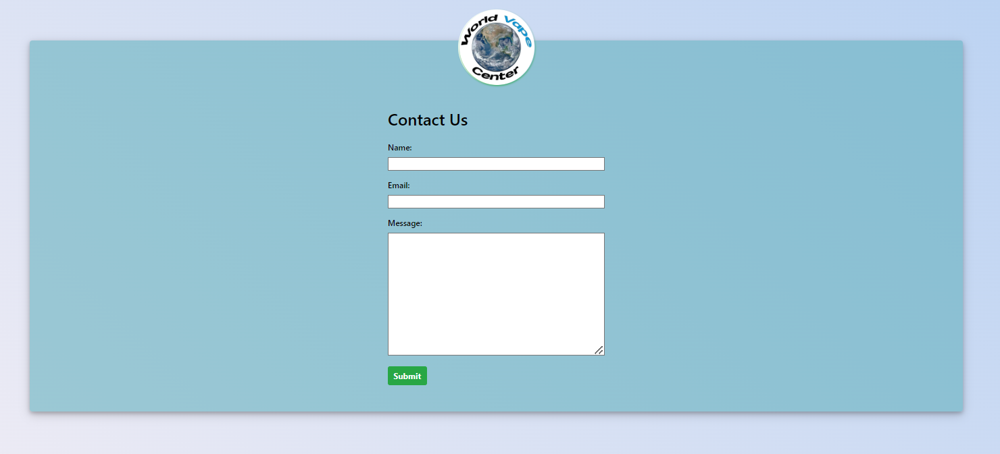
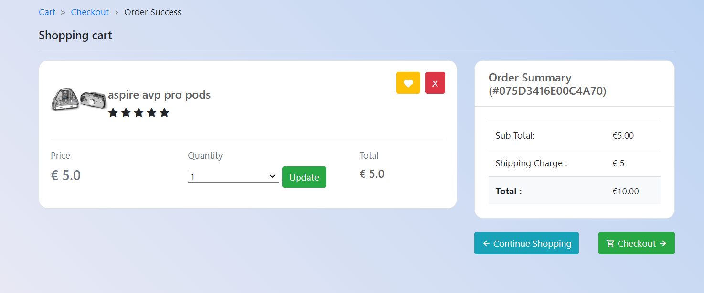

# __World Vape Center - Portfolio Project 5__


Welcome to the World Vape Center repository! This repository houses the source code for our cutting-edge vape shop website, where enthusiasts can explore and purchase a wide range of vaping products. From premium e-liquids to state-of-the-art vaping devices, World Vape Center is your go-to destination for all things vaping.

Developed by Jamie O'Neill

[Live link to website](https://world-vape-center-468f3f7d12a1.herokuapp.com/products)

## UX

When creating this site, I aimed for a straightforward design. Complicating the layout of an e-commerce store can lead to a less-than-ideal user experience, something we definitely want to avoid when encouraging users to become customers.

Throughout the site, users can easily track their basket's total while browsing and adding items. This approach builds trust with users, unlike some sites that hide this information until the checkout stage, potentially leading users to overspend.

Navigation is user-friendly through the main menu, ensuring easy exploration of all vape categories. The site is built to provide straightforward access to different vape product categories.

In essence, the site prioritizes simplicity and transparency, contributing to an overall positive and hassle-free user experience.

### Colour Scheme


- `#F7F0F5` and `#3DA5D9` used for the site background.
- `#E84610` used for primary text across the site.
- `#00bfc3` used for secondary text.
- `#ffd33b` used for highlights including headers.
- `#ff2273` used for secondary highlights such as borders around cards and the homepage button.

I used [coolors.co](https://coolors.co/383f51-bad2f2-f7f0f5-87b38d-e94f37) to generate my colour palette.


I've used CSS `:root` variables to easily update the global colour scheme by changing only one value, instead of everywhere in the CSS file.

```css
:root {
    --magnolia: #F7F0F5;
    --charcoal: #383F51;
    --light-blue: #3DA5D9;
    --muted-green: #87B38D;
    --warn-red: #E94F37;
}
```

### Typography

When choosing fonts for the site, my main goal was to choose fonts that were easily readable for users. 

- [Caprasimo](https://fonts.google.com/specimen/Caprasimo) was used for the logo text in the main nav bar and the large text on the home page.

- [Montserrat](https://fonts.google.com/specimen/Montserrat) was used for all other text.

- [Font Awesome](https://fontawesome.com) icons were used throughout the site, such as the social media icons in the footer.

## User Stories

To help with the development of this project, I created user stories to map out tasks I needed to achieve in order to build the website to a good standard. I further split these user stories into epics in order to take an agile approach to its development.

View a full list of user stories [here](https://github.com/jamie33o/world-vape-center/issues) or on the project board [here](https://github.com/users/jamie33o/projects/15/views/1).

View the Sprints here [here](https://github.com/jamie33o/world-vape-center/milestones).

## Wireframes

To help with the design of the site, I created wireframes for each page. To follow best practice, wireframes were developed for mobile, tablet, and desktop sizes.
I've used [Balsamiq](https://balsamiq.com/wireframes) to design my site wireframes.

### Age verification Wireframes

<details>
<summary>Click to View Age verification wireframes</summary>


</details>

### Contact Page Wireframes

<details>
<summary>Click to View Contact Page wireframes</summary>


</details>

### Drop down menu Wireframes

<details>
<summary>Click to View Drop down wireframes</summary>


</details>

### Home Page Wireframes

<details>
<summary>Click to View Home Page wireframes</summary>


</details>

### Search bar Wireframes

<details>
<summary>Click to View Search bar wireframe</summary>


</details>

### Mobile filters Wireframes

<details>
<summary>Click to View Mobile filters wireframe</summary>


</details>

### Product page Wireframes

<details>
<summary>Click to View Product page wireframe</summary>


</details>

### Sign Up Page Wireframes

<details>
<summary>Click to View Sign Up Page wireframe</summary>


</details>

### Sign In Page Wireframe

<details>
<summary>Click to View Sign In Page wireframes</summary>


</details>


## Features

### Existing Features

- **Landing Page**

    - This is the page a user lands on when arriving at the site. It welcomes them to the site and gives them an idea of what the site sells. A button is present that will bring the user to the site's product page.

    

- **All Products Page**

    - This is a page containing all products that the site sells.

    

- **Product Card**

    - Each product has its own card which contains the product's price, image, name, favourite button and review count if there are any.
    - If the user is logged in, they will also see a favourite button to add products to there favourites section in there profile.

    


- **Product detail page**

    - Every product has a button that lets the user to add it to their basket when viewing individual product page. They can choose the quantity as well.
    - The cart modal shows up after user adds a product confirming the item has been added to their basket.

    

    

    

- **Product Sorting**

    - When the user is viewing products page, they can choose the amount of products per page 

    

- **Main Nav Menu**

    - Throughout the whole site the user has access to the main nav menu. Features include a search button, account/profile access, basket link and running total if the user has items added to their baskets.

    

- **Product Filtering**

    - On the products page the user has the option to filter products by brand or multi options.

    


- **Search Bar**
    - Users can use the header search button to open the search input field and search to find specific products. The search term is matched up with products' name and description to give the user a list of products to match their search term.
	- The search brings back 5 products each letter the user types until they find the product they want

    

    
    

- **My Account Dropdown**

    - If the user is logged in, the my account dropdown in the nav menu will contain a link to the user's profile, change password, logout and email settings page.
	- If the user isn't logged in they will be given the option to sign in. 

   

- **Admin Dropdown**

    - If the user is logged in and has admin permissions, they will see an admin option in the account menu dropdown.

    

- **Add brand to multiple products**

    - If the user is logged in and has admin permissions, they can add a brand to multiple products at once.

    

- **Add choice to multiple products**

    - If the user is logged in and has admin permissions, they can add a multi choice to multiple products at once.

    

- **Add prices to multiple products**

    - If the user is logged in and has admin permissions, they can add a price to multiple products at once.

    

- **User Sign Up**

    - Users without an account can register for one through the register link in the header. This will present them with a form to add their details and created a profile for that user on completion.
	- Users are sent a confirmation email to complete their account sign up to help avoid people from creating spam accounts on the site.

    

- **User Sign In**

    - If a user isn't signed in to the site but has a profile, they can follow the sign in link in the header where they're presented with a log in page. They must input their username or email address and correct password to do so. There's also a checkbox to let the user be remembered on their current device to avoid having to log in every time they visit the site.
	- There's a link for users who have forgotten their password.

    

- **User Sign Out**

    - If a user wants to end their logged in session, they can click logout under the account dropdown in the nav menu.
    - This will bring them to a page confirming they want to log out.

    

- **Password Reset**

    - If a user is trying to log in and has forgotten their password they can visit the password reset page. Here a user must enter their email address they used to sign up with and an email will be sent to them with further instructions on resetting their password to regain access to their account.

    


- **User Profile**

    - When a user has completed registration on the site, they are given a profile.

    

- **Shipping address**

    - On the user's profile there is a form containing the user's default delivery information if the user has saved it. The user can update this information from their profile by altering the form and clicking the update information button. This information will be automatically used for the user's next purchase to make the site easier to use for customers.

    

- **Order History**

    - Users can view a list with their full order history on their profiles. The data is displayed in a table with each row including the order number, time and date of purchase, items included in the order and the total of each order.
	
    

- **Site Footer**

    - This appears across the whole site and contains links to the help pages, social media pages and the store's address.
  

    

- **Newsletter**

    - Using the form in the footer, users can sign up to the site's newsletter 

    

  
- **Contact Us Page**

    - This page can be accessed from the header across the site.

    


- **Basket**

    - The basket can be accessed from the main nav menu.
    - In the menu a running total is shown of the items in the user's basket.
    - When the user clicks on this they can see all the items in their basket, individual price of each product, subtotal per product if the quantity is greater than 1 and a quantity selector for each product with buttons to update the quantity or remove the product completely from their basket.
    - If a user doesn't have anything in their basket, a message will appear prompting the user to continue shopping.

    

    


- **Cart summary page**

    - On this page the user can update quantity or remove product and the user gets a summary of the the order.

    


- **Checkout**

    - The final step of the users shopping journey on the site is the checkout page.
    - This page contains a form for the user's delivery and payment information and a summary of the user's order.
    - If the user has an account on the site, they can save their delivery information on their profile to automatically be filled in the checkout.

    

- **Order received Email**

    - Once the order is complete, the user will receive an order confirmation email informing user that there order has been received.

    


- **Order Confirmation Email**

    - Once the order is complete and payment has been received, the user will receive an order confirmation email containing their order number and a receipt with the total paid.

    

- **Order Confirmation Page**

    - After the order has been completed, the user is redirected to a confirmation page letting them know an order confirmation email has been sent to their provided email address.
    - This page contains a final rundown of the order and what the user purchased.
    - This page can be accessed again from the user's profile if they have an account on the site by clicking the order number from the list of past orders.

    

    

    


- **Error Pages**

    - If a user ends up on a page that either doesn't exist or that they shouldn't be on (regular user using admin page links or trying to edit/delete something through a link) then they'll be shown an error page with a button to bring them back to the shop.

    

    

    

### Future Features

While I feel that the site has an abundance of features, there are several ones I would like to add in the future that didn't fit into the current development cycle for this project. These features have been logged as Won't Have in my MoSCoW prioritization and placed in the backlog of my project's development board.
