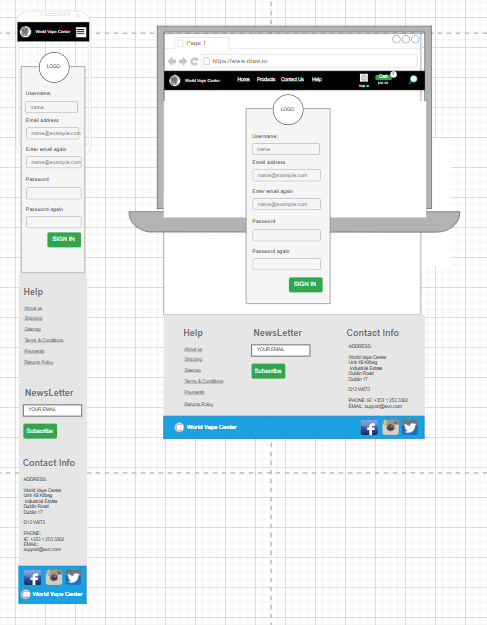
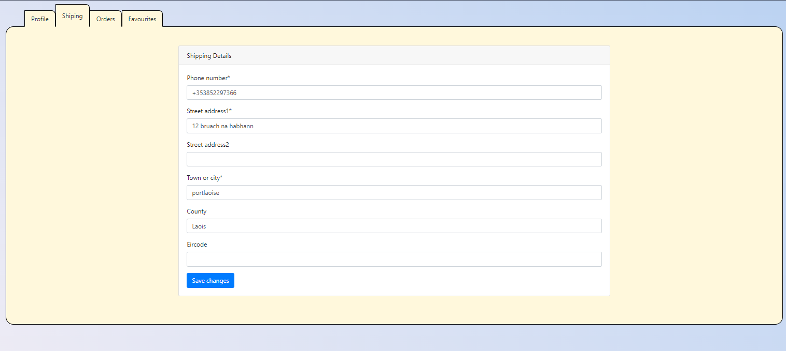
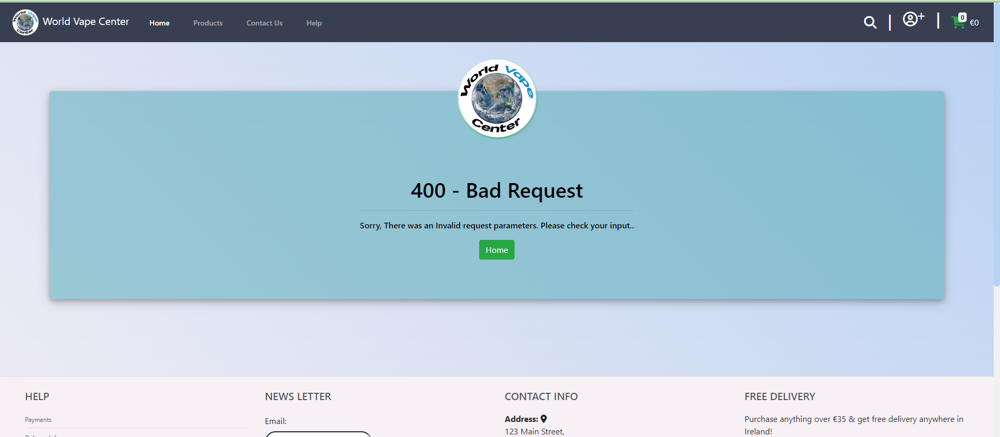

# __World Vape Center - Portfolio Project 5__


Welcome to the World Vape Center repository! This repository houses the source code for our cutting-edge vape shop website, where enthusiasts can explore and purchase a wide range of vaping products. From premium e-liquids to state-of-the-art vaping devices, World Vape Center is your go-to destination for all things vaping.

Developed by Jamie O'Neill

[Live link to website](https://world-vape-center-468f3f7d12a1.herokuapp.com/products)

## UX

When creating this site, I aimed for a straightforward design. Complicating the layout of an e-commerce store can lead to a less-than-ideal user experience, something we definitely want to avoid when encouraging users to become customers.

Throughout the site, users can easily track their basket's total while browsing and adding items. This approach builds trust with users, unlike some sites that hide this information until the checkout stage, potentially leading users to overspend.

Navigation is user-friendly through the main menu, ensuring easy exploration of all vape categories. The site is built to provide straightforward access to different vape product categories.

In essence, the site prioritizes simplicity and transparency, contributing to an overall positive and hassle-free user experience.

### Colour Scheme

- `#F7F0F5` and `#3DA5D9` used for the site background.
- `#E84610` used for primary text across the site.
- `#00bfc3` used for secondary text.
- `#ffd33b` used for highlights including headers.
- `#ff2273` used for secondary highlights such as borders around cards and the homepage button.

I used [coolors.co](https://coolors.co/383f51-bad2f2-f7f0f5-87b38d-e94f37) to generate my colour palette.


I've used CSS `:root` variables to easily update the global colour scheme by changing only one value, instead of everywhere in the CSS file.

```css
:root {
    --magnolia: #F7F0F5;
    --charcoal: #383F51;
    --light-blue: #3DA5D9;
    --muted-green: #87B38D;
    --warn-red: #E94F37;
}
```

### Typography

When choosing fonts for the site, my main goal was to choose fonts that were easily readable for users. 

- [Roboto](https://fonts.google.com/specimen/Roboto) was used for headings.

- [Arial](https://fonts.google.com/specimen/Montserrat) was used for all other text.

- [Font Awesome](https://fontawesome.com) icons were used throughout the site, such as the social media icons in the footer.

## User Stories

To help with the development of this project, I created user stories to map out tasks I needed to achieve in order to build the website to a good standard. I further split these user stories into epics in order to take an agile approach to its development.

View a full list of user stories [here](https://github.com/jamie33o/world-vape-center/issues) or on the project board [here](https://github.com/users/jamie33o/projects/15/views/1).

View the Sprints here [here](https://github.com/jamie33o/world-vape-center/milestones).

## Wireframes

To help with the design of the site, I created wireframes for each page. To follow best practice, wireframes were developed for mobile and desktop sizes.
I've used [Balsamiq](https://balsamiq.com/wireframes) to design my site wireframes.

### Age verification Wireframes

<details>
<summary>Click to View Age verification wireframes</summary>


</details>

### Contact Page Wireframes

<details>
<summary>Click to View Contact Page wireframes</summary>


</details>

### Drop down menu Wireframes

<details>
<summary>Click to View Drop down wireframes</summary>


</details>

### Home Page Wireframes

<details><summary>Click to View Home Page wireframes</summary>


</details>

### Search bar Wireframes

<details>
<summary>Click to View Search bar wireframe</summary>


</details>

### Mobile filters Wireframes

<details>
<summary>Click to View Mobile filters wireframe</summary>


</details>

### Product page Wireframes

<details>
<summary>Click to View Product page wireframe</summary>


</details>

### Sign Up Page Wireframes

<details>
<summary>Click to View Sign Up Page wireframe</summary>




</details>

### Sign In Page Wireframe

<details>
<summary>Click to View Sign In Page wireframes</summary>


</details>

## Features

### Existing Features

- **Landing Page**

    - This is the page a user lands on when arriving at the site. It welcomes them to the site and gives them an idea of what the site sells. A button is present that will bring the user to the site's product page.

    

- **Products Page**

    - This is the page containing the products that the site sells.

    

- **Product Card**

    - Each product has its own card which contains the product's price, image, name, favourite button and review count if there are any.
    - If the user is logged in, they will also see a favourite button to add products to there favourites section in there profile.

    


- **Product detail page**

    - Every product has a button that lets the user to add it to their basket when viewing individual product page. They can choose the quantity as well.
    - The cart modal shows up after user adds a product confirming the item has been added to their basket.

    

    

    

- **Product Sorting**

    - When the user is viewing products page, they can choose the amount of products per page 

    

- **Main Nav Menu**

    - Throughout the whole site the user has access to the main nav menu. Features include a search button, account/profile access, basket link and running total if the user has items added to their baskets.

    

- **Product Filtering**

    - On the products page the user has the option to filter products by brand or multi options.

    


- **Search Bar**
    - Users can use the header search button to open the search input field and search to find specific products. The search term is matched up with products' name and description to give the user a list of products to match their search term.
	- The search brings back 5 products each letter the user types until they find the product they want

    

    
    

- **My Account Dropdown**

    - If the user is logged in, the my account dropdown in the nav menu will contain a link to the user's profile, change password, logout and email settings page.
	- If the user isn't logged in they will be given the option to sign in. 

   

- **Admin Dropdown**

    - If the user is logged in and has admin permissions, they will see an admin option in the account menu dropdown.

    

- **Add brand to multiple products**

    - If the user is logged in and has admin permissions, they can add a brand to multiple products at once.

    

- **Add choice to multiple products**

    - If the user is logged in and has admin permissions, they can add a multi choice to multiple products at once.

    

- **Add prices to multiple products**

    - If the user is logged in and has admin permissions, they can add a price to multiple products at once.

    

- **User Sign Up**

    - Users without an account can register for one through the register link in the header. This will present them with a form to add their details and create an account.
	- Users are sent a confirmation email to complete their account sign up to help avoid people from creating spam accounts on the site.

    

- **User Sign In**

    - If a user isn't signed in to the site but has a profile, they can follow the sign in link in the header where they're presented with a log in page. They must input their username or email address and correct password to do so. There's also a checkbox to let the user be remembered on their current device to avoid having to log in every time they visit the site.
	- There's a link for users who have forgotten their password.

    

- **User Sign Out**

    - If a user wants to end their logged in session, they can click logout under the account dropdown in the nav menu.
    - This will bring them to a page confirming they want to log out.

    

- **Password Reset**

    - If a user is trying to log in and has forgotten their password they can visit the password reset page. Here a user must enter their email address they used to sign up with and an email will be sent to them with further instructions on resetting their password to regain access to their account.

    

- **User Profile**

    - When a user has completed registration on the site, they are given a profile.

    

- **Shipping address**

    - On the user's profile there is a form containing the user's default delivery information if the user has saved it. The user can update this information from their profile by altering the form and clicking the update information button. This information will be automatically used for the user's next purchase to make the site easier to use for customers.

    

- **Order History**

    - Users can view a list with their full order history on their profiles. The data is displayed in a table with each row including the order number, time and date of purchase, items included in the order and the total of each order.
	
    

- **Site Footer**

    - This appears across the whole site and contains links to the help pages, social media pages and the store's address.
  

    

- **Newsletter**

    - Using the form in the footer, users can sign up to the site's newsletter 

    

  
- **Contact Us Page**

    - This page can be accessed from the header across the site.

    


- **Basket**

    - The basket can be accessed from the main nav menu.
    - In the menu a running total is shown of the items in the user's basket.
    - When the user clicks on this they can see all the items in their basket, individual price of each product, subtotal per product if the quantity is greater than 1 and a quantity selector for each product with buttons to update the quantity or remove the product completely from their basket.
    - If a user doesn't have anything in their basket, a message will appear prompting the user to continue shopping.

    

    


- **Cart summary page**

    - On this page the user can update quantity or remove product and the user gets a summary of the the order.

    


- **Checkout**

    - The final step of the users shopping journey on the site is the checkout page.
    - This page contains a form for the user's delivery and payment information and a summary of the user's order.
    - If the user has an account on the site, they can save their delivery information on their profile to automatically be filled in the checkout.

    

- **Order received Email**

    - Once the order is complete, the user will receive an order confirmation email informing user that there order has been received.

    


- **Order Confirmation Email**

    - Once the order is complete and payment has been received, the user will receive an order confirmation email containing their order number and a receipt with the total paid.

    


- **Error Pages**

    - If a user ends up on a page that either doesn't exist or that they shouldn't be on (regular user using admin page links or trying to edit/delete something through a link) then they'll be shown an error page with a button to bring them back to the shop.

    

    

    

    


### Future Features

While I feel that the site has an abundance of features, there are several ones I would like to add in the future that didn't fit into the current development cycle for this project. These features have been logged as Won't Have in my MoSCoW prioritization and placed in the backlog of my project's development board.


## Tools & Technologies Used

This site couldn't have been created without a variety of tools and technologies. I've listed the ones used below.

- [HTML](https://en.wikipedia.org/wiki/HTML) used for the main site content.
- [CSS](https://en.wikipedia.org/wiki/CSS) used for the main site design and layout.
- [CSS :root variables](https://www.w3schools.com/css/css3_variables.asp) used for reusable styles throughout the site.
- [CSS Flexbox](https://www.w3schools.com/css/css3_flexbox.asp) used for an enhanced responsive layout.
- [JavaScript](https://www.javascript.com) used for user interaction on the site.
- [Python](https://www.python.org) used as the back-end programming language.
- [Git](https://git-scm.com) used for version control. (`git add`, `git commit`, `git push`)
- [GitHub](https://github.com) used for secure online code storage.
- [Bootstrap](https://getbootstrap.com) used as the front-end CSS framework for modern responsiveness and pre-built components.
- [Django](https://www.djangoproject.com) used as the Python framework for the site.
- [PostgreSQL](https://www.postgresql.org) used as the relational database management.
- [ElephantSQL](https://www.elephantsql.com) used as the Postgres database.
- [Heroku](https://www.heroku.com) used for hosting the deployed back-end site.
- [Stripe](https://stripe.com) used for online secure payments of ecommerce products/services.
- [AWS S3](https://aws.amazon.com/s3) used for online static file storage.
- [Django Summernote](https://github.com/summernote/django-summernote) used for the body field for blog posts.
- [Pillow](https://pypi.org/project/Pillow/) used for handling images.

## Database Design

I created an entity relationship diagram using [Draw.io](https://draw.io). This helped me to visualize the relationships between my data structures and made the development process easier as I had everything mapped out in front of me for reference to avoid having to reference each models.py file individually.


## Agile Development Process

### GitHub Projects

[GitHub Projects](https://github.com/jamie33o/world-vape-center/projects) served as an Agile tool for this project.
It isn't a specialized tool, but with the right tags and project creation/issue assignments, it can be made to work.

### GitHub Issues

[GitHub Issues](https://github.com/jamie33o/world-vape-center/issues) served as an another Agile tool.
There, I used my own **User Story Template** to manage user stories.

It also helped to keep on top of my [milestones](https://github.com/jamie33o/world-vape-center/milestones) for the project.

### MoSCoW Prioritization

I've decomposed my Epics into stories prior to prioritizing and implementing them.
Using this approach, I was able to apply the MoSCow prioritization and labels to my user stories within the Issues tab.

- **Must Have**: guaranteed to be delivered (*max 60% of stories*)
- **Should Have**: adds significant value, but not vital (*the rest ~20% of stories*)
- **Could Have**: has small impact if left out (*20% of stories*)
- **Won't Have**: not a priority for this iteration

## Ecommerce Business Model

This site sells goods to individual customers, and therefore follows a `Business to Customer` model.
It is of the simplest **B2C** forms, as it focuses on individual transactions, and doesn't need anything
such as monthly/annual subscriptions.

It is still in its early development stages, although it already has a newsletter, and links for social media marketing.

Social media can potentially build a community of users around the business, and boost site visitor numbers,
especially when using larger platforms such a Facebook.

A newsletter list can be used by the business to send regular messages to site users.
For example, what items are on special offer, new items in stock,
updates to business hours, notifications of events, and much more!

## Search Engine Optimization (SEO) & Social Media Marketing

### Keywords

I've identified some appropriate keywords to align with my site, that should help users
when searching online to find my page easily from a search engine.
This included a series of the following keyword types

- Short-tail (head terms) keywords
- Long-tail keywords

I also played around with [Word Tracker](https://www.wordtracker.com) a bit
to check the frequency of some of my site's primary keywords (only until the free trial expired).

### Sitemap

I've used the built in 'django.contrib.sitemaps' app to generate the sitemap.xml I also created a
html sitemap for users to view.

### Robots

I've created the [robots.txt](robots.txt) file at the root-level.
Inside, I've included the default settings:

```
User-agent: *
Disallow: /admin/
Sitemap: https://world-vape-center.herokuapp.com/sitemap.xml
```

Further links for future implementation:
- [Google search console](https://search.google.com/search-console)
- [Creating and submitting a sitemap](https://developers.google.com/search/docs/advanced/sitemaps/build-sitemap)
- [Managing your sitemaps and using sitemaps reports](https://support.google.com/webmasters/answer/7451001)
- [Testing the robots.txt file](https://support.google.com/webmasters/answer/6062598)


### Newsletter Marketing

I have incorporate a newsletter sign-up form on my application, to allow users to supply their
email address if they are interested in learning more about what the business has to offer.

I created a custom newsletter app in my project with a custom NewsletterSignup model and added a form to the site's footer to collect user email addresses 

Newsletter model:

```python
class NewsletterSignup(models.Model):
    email = models.EmailField(unique=True, null=False, blank=False)

def __str__(self):
    return self.email
```

I set the email address to be unique to avoid users signing up multiple times with the same email address. 

Once a user signs up, I used the `send_mail()` functionality to trigger a welcome email for the user to acknowledge that they've successfully signed up for the newsletter.

## Testing

For all testing, please refer to the [TESTING.md](TESTING.md) file.

## Deployment

The live deployed application can be found deployed on [Heroku](https://world-vape-center-468f3f7d12a1.herokuapp.com/).

### Amazon AWS

This project uses [AWS](https://aws.amazon.com) to store media and static files online, due to the fact that Heroku doesn't persist this type of data.

Once you've created an AWS account and logged-in, follow these series of steps to get your project connected.
Make sure you're on the **AWS Management Console** page.

#### S3 Bucket

- Search for **S3**.
- Create a new bucket, give it a name (matching your Heroku app name), and choose the region closest to you.
- Uncheck **Block all public access**, and acknowledge that the bucket will be public (required for it to work on Heroku).
- From **Object Ownership**, make sure to have **ACLs enabled**, and **Bucket owner preferred** selected.
- From the **Properties** tab, turn on static website hosting, and type `index.html` and `error.html` in their respective fields, then click **Save**.
- From the **Permissions** tab, paste in the following CORS configuration:

	```shell
	[
		{
			"AllowedHeaders": [
				"Authorization"
			],
			"AllowedMethods": [
				"GET"
			],
			"AllowedOrigins": [
				"*"
			],
			"ExposeHeaders": []
		}
	]
	```

- Copy your **ARN** string.
- From the **Bucket Policy** tab, select the **Policy Generator** link, and use the following steps:
	- Policy Type: **S3 Bucket Policy**
	- Effect: **Allow**
	- Principal: `*`
	- Actions: **GetObject**
	- Amazon Resource Name (ARN): **paste-your-ARN-here**
	- Click **Add Statement**
	- Click **Generate Policy**
	- Copy the entire Policy, and paste it into the **Bucket Policy Editor**

		```shell
		{
			"Id": "Policy1234567890",
			"Version": "2012-10-17",
			"Statement": [
				{
					"Sid": "Stmt1234567890",
					"Action": [
						"s3:GetObject"
					],
					"Effect": "Allow",
					"Resource": "arn:aws:s3:::your-bucket-name/*"
					"Principal": "*",
				}
			]
		}
		```

	- Before you click "Save", add `/*` to the end of the Resource key in the Bucket Policy Editor (like above).
	- Click **Save**.
- From the **Access Control List (ACL)** section, click "Edit" and enable **List** for **Everyone (public access)**, and accept the warning box.
	- If the edit button is disabled, you need to change the **Object Ownership** section above to **ACLs enabled** (mentioned above).

#### IAM

Back on the AWS Services Menu, search for and open **IAM** (Identity and Access Management).
Once on the IAM page, follow these steps:

- From **User Groups**, click **Create New Group**.
	- Suggested Name: `group-wvc` (group + the project name)
- Tags are optional, but you must click it to get to the **review policy** page.
- From **User Groups**, select your newly created group, and go to the **Permissions** tab.
- Open the **Add Permissions** dropdown, and click **Attach Policies**.
- Select the policy, then click **Add Permissions** at the bottom when finished.
- From the **JSON** tab, select the **Import Managed Policy** link.
	- Search for **S3**, select the `AmazonS3FullAccess` policy, and then **Import**.
	- You'll need your ARN from the S3 Bucket copied again, which is pasted into "Resources" key on the Policy.

		```shell
		{
			"Version": "2012-10-17",
			"Statement": [
				{
					"Effect": "Allow",
					"Action": "s3:*",
					"Resource": [
						"arn:aws:s3:::your-bucket-name",
						"arn:aws:s3:::your-bucket-name/*"
					]
				}
			]
		}
		```
	
	- Click **Review Policy**.
	- Suggested Name: `policy-wvc` (policy + the project name)
	- Provide a description:
		- "Access to S3 Bucket for retro-reboot static files."
	- Click **Create Policy**.
- From **User Groups**, click your "group-retro-reboot".
- Click **Attach Policy**.
- Search for the policy you've just created ("policy-retro-reboot") and select it, then **Attach Policy**.
- From **User Groups**, click **Add User**.
	- Suggested Name: `user-wvc` (user + the project name)
- For "Select AWS Access Type", select **Programmatic Access**.
- Select the group to add your new user to: `group-wvc`
- Tags are optional, but you must click it to get to the **review user** page.
- Click **Create User** once done.
- You should see a button to **Download .csv**, so click it to save a copy on your system.
	- **IMPORTANT**: once you pass this page, you cannot come back to download it again, so do it immediately!
	- This contains the user's **Access key ID** and **Secret access key**.
	- `AWS_ACCESS_KEY_ID` = **Access key ID**
	- `AWS_SECRET_ACCESS_KEY` = **Secret access key**

#### Final AWS Setup

- If Heroku Config Vars has `DISABLE_COLLECTSTATIC` still, this can be removed now, so that AWS will handle the static files.
- Back within **S3**, create a new folder called: `media`.
- Select any existing media images for your project to prepare them for being uploaded into the new folder.
- Under **Manage Public Permissions**, select **Grant public read access to this object(s)**.
- No further settings are required, so click **Upload**.

### Stripe API

This project uses [Stripe](https://stripe.com) to handle the ecommerce payments.

Once you've created a Stripe account and logged-in, follow these series of steps to get your project connected.

- From your Stripe dashboard, click to expand the "Get your test API keys".
- You'll have two keys here:
	- `STRIPE_PUBLIC_KEY` = Publishable Key (starts with **pk**)
	- `STRIPE_SECRET_KEY` = Secret Key (starts with **sk**)

As a backup, in case users prematurely close the purchase-order page during payment, we can include Stripe Webhooks.

- From your Stripe dashboard, click **Developers**, and select **Webhooks**.
- From there, click **Add Endpoint**.
- Click **receive all events**.
- Click **Add Endpoint** to complete the process.
- You'll have a new key here:
	- `STRIPE_WH_SECRET` = Signing Secret (Wehbook) Key (starts with **wh**)

### Gmail API

This project uses [Gmail](https://mail.google.com) to handle sending emails to users for account verification and purchase order confirmations.

Once you've created a Gmail (Google) account and logged-in, follow these series of steps to get your project connected.

- Click on the **Account Settings** (cog icon) in the top-right corner of Gmail.
- Click on the **Accounts and Import** tab.
- Within the section called "Change account settings", click on the link for **Other Google Account settings**.
- From this new page, select **Security** on the left.
- Select **2-Step Verification** to turn it on. (verify your password and account)
- Once verified, select **Turn On** for 2FA.
- Navigate back to the **Security** page, and you'll see a new option called **App passwords**.
- This might prompt you once again to confirm your password and account.
- Select **Mail** for the app type.
- Select **Other (Custom name)** for the device type.
	- Any custom name, such as "Django" or retro-reboot
- You'll be provided with a 16-character password (API key).
	- Save this somewhere locally, as you cannot access this key again later!
	- `EMAIL_HOST_PASS` = user's 16-character API key
	- `EMAIL_HOST_USER` = user's own personal Gmail email address

### Heroku Deployment

This project uses [Heroku](https://www.heroku.com), a platform as a service (PaaS) that enables developers to build, run, and operate applications entirely in the cloud.

Deployment steps are as follows, after account setup:

- Select **New** in the top-right corner of your Heroku Dashboard, and select **Create new app** from the dropdown menu.
- Your app name must be unique, and then choose a region closest to you (EU or USA), and finally, select **Create App**.
- From the new app **Settings**, click **Reveal Config Vars**, and set your environment variables.

| Key | Value |
| --- | --- |
| `AWS_ACCESS_KEY_ID` | user's own value |
| `AWS_SECRET_ACCESS_KEY` | user's own value |
| `DATABASE_URL` | user's own value |
| `DISABLE_COLLECTSTATIC` | 1 (*this is temporary, and can be removed for the final deployment*) |
| `EMAIL_HOST_PASS` | user's own value |
| `EMAIL_HOST_USER` | user's own value |
| `SECRET_KEY` | user's own value |
| `STRIPE_PUBLIC_KEY` | user's own value |
| `STRIPE_SECRET_KEY` | user's own value |
| `STRIPE_WH_SECRET` | user's own value |
| `USE_AWS` | True |

Heroku needs two additional files in order to deploy properly.
- requirements.txt
- Procfile

You can install this project's **requirements** (where applicable) using:
- `pip3 install -r requirements.txt`

If you have your own packages that have been installed, then the requirements file needs updated using:
- `pip3 freeze --local > requirements.txt`

The **Procfile** can be created with the following command:
- `echo web: gunicorn app_name.wsgi > Procfile`
- *replace **app_name** with the name of your primary Django app name; the folder where settings.py is located*

For Heroku deployment, follow these steps to connect your own GitHub repository to the newly created app:

Either:
- Select **Automatic Deployment** from the Heroku app.

Or:
- In the Terminal/CLI, connect to Heroku using this command: `heroku login -i`
- Set the remote for Heroku: `heroku git:remote -a app_name` (replace *app_name* with your app name)
- After performing the standard Git `add`, `commit`, and `push` to GitHub, you can now type:
	- `git push heroku main`

The project should now be connected and deployed to Heroku!

### Local Deployment

This project can be cloned or forked in order to make a local copy on your own system.

For either method, you will need to install any applicable packages found within the *requirements.txt* file.
- `pip3 install -r requirements.txt`.

You will need to create a new file called `env.py` at the root-level,
and include the same environment variables listed above from the Heroku deployment steps.

Sample `env.py` file:

```python
import os

os.environ.setdefault("AWS_ACCESS_KEY_ID", "user's own value")
os.environ.setdefault("AWS_SECRET_ACCESS_KEY", "user's own value")
os.environ.setdefault("DATABASE_URL", "user's own value")
os.environ.setdefault("EMAIL_HOST_PASS", "user's own value")
os.environ.setdefault("EMAIL_HOST_USER", "user's own value")
os.environ.setdefault("SECRET_KEY", "user's own value")
os.environ.setdefault("STRIPE_PUBLIC_KEY", "user's own value")
os.environ.setdefault("STRIPE_SECRET_KEY", "user's own value")
os.environ.setdefault("STRIPE_WH_SECRET", "user's own value")

# local environment only (do not include these in production/deployment!)
os.environ.setdefault("DEBUG", "True")
```

Once the project is cloned or forked, in order to run it locally, you'll need to follow these steps:
- Start the Django app: `python3 manage.py runserver`
- Stop the app once it's loaded: `CTRL+C` or `⌘+C` (Mac)
- Make any necessary migrations: `python3 manage.py makemigrations`
- Migrate the data to the database: `python3 manage.py migrate`
- Create a superuser: `python3 manage.py createsuperuser`
- Load fixtures (if applicable): `python3 manage.py loaddata file-name.json` (repeat for each file)
- Everything should be ready now, so run the Django app again: `python3 manage.py runserver`

If you'd like to backup your database models, use the following command for each model you'd like to create a fixture for:
- `python3 manage.py dumpdata your-model > your-model.json`
- *repeat this action for each model you wish to backup*

#### Cloning

You can clone the repository by following these steps:

1. Go to the [GitHub repository](https://github.com/jamie33o/world-vape-center) 
2. Locate the Code button above the list of files and click it 
3. Select if you prefer to clone using HTTPS, SSH, or GitHub CLI and click the copy button to copy the URL to your clipboard
4. Open Git Bash or Terminal
5. Change the current working directory to the one where you want the cloned directory
6. In your IDE Terminal, type the following command to clone my repository:
	- `git clone https://github.com/jamie33o/world-vape-center.git`
7. Press Enter to create your local clone.


#### Forking

By forking the GitHub Repository, we make a copy of the original repository on our GitHub account to view and/or make changes without affecting the original owner's repository.
You can fork this repository by using the following steps:

1. Log in to GitHub and locate the [GitHub Repository](https://github.com/jamie33o/world-vape-center)
2. At the top of the Repository (not top of page) just above the "Settings" Button on the menu, locate the "Fork" Button.
3. Once clicked, you should now have a copy of the original repository in your own GitHub account!

### Local VS Deployment

To my knowledge there are no differences between the local and deployed versions of this site.

## Credits

This project could not have been completed without some help from the internet for various code-snippets to inspire the final project, media to fill the site with and people to support me along the way. In the following sections I want to give credit for my sources and people who've inspired me throughout development.

### Content

I used some online resources to help me overcome some challenges I faced during development and to inspire some elements I used in the site. You can find them below.

| Source | Location | Notes |
| --- | --- | --- |
| [Bootsnipp](https://bootsnipp.com/) | Templates | Used to get some bootstrap snippets |
| [Bootstrap](https://getbootstrap.com/docs/4.0/components/modal/) | Modal | Used to get Modals |


### Media

I used some media found online throughout this project, in particular for product images. You can find the credits for these below.

| Source | Location | Type | Notes |
| --- | --- | --- | --- |
| [Join the vape life](https://jointhevapelife.ie/) | product | Image | All product images |


## Acknowledgements
- [Code Institute](https://github.com/Code-Institute-Org/full_stack_solutions) for all the material and support offered<br>
- My mentor [Gareth Mc Girr](https://github.com/Gareth-McGirr) for great tips and his willingness to help me as much as possible with the problems encountered during the development of the project<br>
- Slack community for great involvement in helping each other<br>
<hr>
