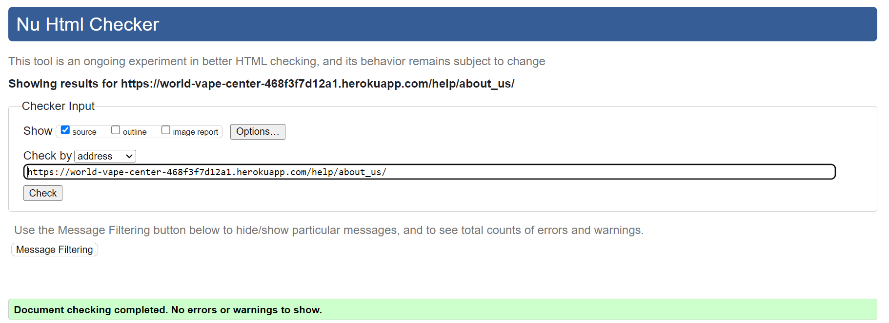
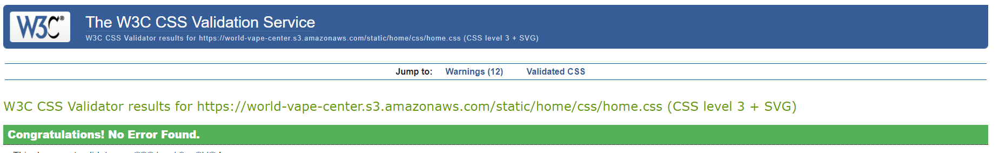
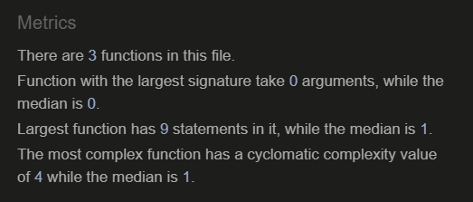
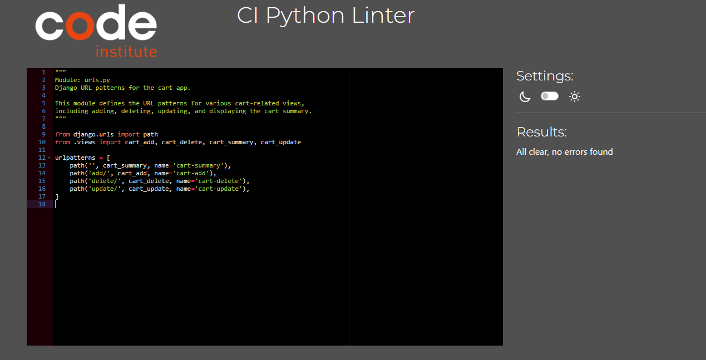
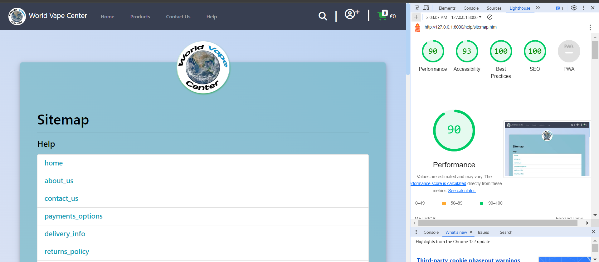

# Testing

Return back to the [README.md](README.md) file.

Throughout the development of this project, I've carried out numerous tests to ensure that the site works well. In this section you will find documentation of all tests carried out throughout the site.

## Code Validation

I have validated all of my code using the recommended tools for each language.

### HTML

I have used the recommended [HTML W3C Validator](https://validator.w3.org) to validate all of my HTML files.

| Page | W3C URL | Screenshot | Notes |
| --- | --- | --- | --- |
| Home | [W3C](https://validator.w3.org/nu/?showsource=yes&doc=https%3A%2F%2Fworld-vape-center-468f3f7d12a1.herokuapp.com%2F#l377c9) |  | Pass: No Errors |
| All Products | [W3C](https://validator.w3.org/nu/?showsource=yes&doc=https%3A%2F%2Fworld-vape-center-468f3f7d12a1.herokuapp.com%2Fproducts#l377c9) |  | Pass: No Errors |
| Individual Product | [W3C](https://validator.w3.org/nu/?showsource=yes&doc=https%3A%2F%2Fworld-vape-center-468f3f7d12a1.herokuapp.com%2Fproducts%2Faccessories%2Faspire-guroo-replacement-glass-5ml%2F#l377c9) |  | Pass: No Errors |
| Contact | [W3C](https://validator.w3.org/nu/?showsource=yes&doc=https%3A%2F%2Fworld-vape-center-468f3f7d12a1.herokuapp.com%2Fhelp%2Fcontact-us.html%2F#l377c9) |  | Pass: No Errors |
| Sign Up | [W3C](https://validator.w3.org/nu/?showsource=yes&doc=https%3A%2F%2Fworld-vape-center-468f3f7d12a1.herokuapp.com%2Faccounts%2Fsignup%2F#l377c9) |  | Pass: No Errors |
| Sign In | [W3C](https://validator.w3.org/nu/?showsource=yes&doc=https%3A%2F%2Fworld-vape-center-468f3f7d12a1.herokuapp.com%2Faccounts%2Flogin%2F#l377c9) |  | Pass: No Errors |
| Password Reset | [W3C](https://validator.w3.org/nu/?showsource=yes&doc=https%3A%2F%2Fworld-vape-center-468f3f7d12a1.herokuapp.com%2Faccounts%2Fpassword%2Freset%2F#l377c9) |  | Pass: No Errors |
| Cart | [W3C](https://validator.w3.org/nu/?showsource=yes&doc=https%3A%2F%2Fworld-vape-center-468f3f7d12a1.herokuapp.com%2Fcart%2F#l377c9)  |  | Pass: No Errors |
| Checkout | [W3C](https://validator.w3.org/nu/?showsource=yes&doc=https%3A%2F%2Fworld-vape-center-468f3f7d12a1.herokuapp.com%2Fcheckout%2F#l377c9)  |  | Pass: No Errors |
| Sitemap.html | [W3C](https://validator.w3.org/nu/?showsource=yes&doc=https%3A%2F%2Fworld-vape-center-468f3f7d12a1.herokuapp.com%2Fhelp%2Fsitemap.html)  |  | Pass: No Errors |
| FAQ | [W3C](https://validator.w3.org/nu/?showsource=yes&doc=https%3A%2F%2Fworld-vape-center-468f3f7d12a1.herokuapp.com%2Fhelp%2Ffaq%2F)  |  | Pass: No Errors |
| T&C's | [W3C](https://validator.w3.org/nu/?showsource=yes&doc=https%3A%2F%2Fworld-vape-center-468f3f7d12a1.herokuapp.com%2Fhelp%2Fterms%2F#l241c12)  |  | Pass: No Errors |
| About page | [W3C](https://validator.w3.org/nu/?showsource=yes&doc=https%3A%2F%2Fworld-vape-center-468f3f7d12a1.herokuapp.com%2Fhelp%2Fabout_us%2F#l241c12)  |  | Pass: No Errors |
| Delivery info page | [W3C](https://validator.w3.org/nu/?showsource=yes&doc=https%3A%2F%2Fworld-vape-center-468f3f7d12a1.herokuapp.com%2Fhelp%2Fdelivery_info%2F#l241c12)  |  | Pass: No Errors |
| Payment info | [W3C](https://validator.w3.org/nu/?showsource=yes&doc=https%3A%2F%2Fworld-vape-center-468f3f7d12a1.herokuapp.com%2Fhelp%2Fpayments_options%2F#l241c12)  |  | Pass: No Errors |

### CSS

I have used the recommended [CSS Jigsaw Validator](https://jigsaw.w3.org/css-validator) to validate all of my CSS files.

| File | Jigsaw URL | Screenshot | Notes |
| --- | --- | --- | --- |
| base.css | [Jigsaw](https://jigsaw.w3.org/css-validator/validator?uri=https%3A%2F%2Fworld-vape-center.s3.amazonaws.com%2Fstatic%2Fcss%2Fbase.css&profile=css3svg&usermedium=all&warning=1&vextwarning=&lang=en) |  | Pass: No Errors |
| home.css | [Jigsaw](https://jigsaw.w3.org/css-validator/validator?uri=https%3A%2F%2Fworld-vape-center.s3.amazonaws.com%2Fstatic%2Fhome%2Fcss%2Fhome.css&profile=css3svg&usermedium=all&warning=1&vextwarning=&lang=en)  |  | Pass: No Errors |
| Profile css | N/A |  | Pass: No Errors |
| Product list | N/A |  | Pass: No Errors |
| Product detail | N/A |  | Pass: No Errors |
| cart-summary css | N/A |  | Pass: No Errors |

### JavaScript

I have used the recommended [JShint Validator](https://jshint.com) to validate all of my JS files.

| File | Screenshot | Notes |
| --- | --- | --- |
| base.js |  | Pass: No Errors |
| stripe.js |  | Pass: No Errors |
| account modal.js |  | Pass: No Errors |
| home.js |  | Pass: No Errors |
| product-details |  | Pass: No Errors |
| profile |  | Pass: No Errors |

### Python

I have used the recommended [CI Python Linter](https://pep8ci.herokuapp.com) to validate all of my Python files.

| File | Screenshot | Notes |
| --- | --- | --- |
| cart/views.py |  | Pass: No Errors |
| cart/urls.py |  | Pass: No Errors |
| cart/forms.py |  | Pass: No Errors |
| cart/cart.py |  | Pass: No Errors |
| checkout/webhooks.py |  | Pass: No Errors |
| checkout/webhook-handler.py |  | Pass: No Errors |
| checkout/urls.py |  | Pass: No Errors |
| checkout/views.py |  | Pass: No Errors |
| checkout/models.py |  | Pass: No Errors |
| help/views.py |  | Pass: No Errors |
| help/urls.py |  | Pass: No Errors |
| help/forms.py |  | Pass: No Errors |
| home/views.py |  | Pass: No Errors |
| newsletter/views.py |  | Pass: No Errors |
| product/views.py |  | Pass: No Errors |
| product/urls.py |  | Pass: No Errors |
| product/sitemap.py |  | Pass: No Errors |
| product/models.py |  | Pass: No Errors |
| product/forms.py |  | Pass: No Errors |
| product/create-fictures.py |  | Pass: No Errors |
| product/admin-forms.py |  | Pass: No Errors |
| product/add-discount.py |  | Pass: No Errors |
| profile/views.py |  | Pass: No Errors |
| profile/models.py |  | Pass: No Errors |
| profile/forms.py |  | Pass: No Errors |

## Browser Compatibility

I've tested my deployed project on multiple browsers to check for compatibility issues.

| Browser | Screenshot | Notes |
| --- | --- | --- |
| Chrome |  | Works as expected |
| Firefox |  | Works as expected |
| Edge |  | Works as expected |

## Responsiveness

I've tested my deployed project on multiple devices to check for responsiveness and found no issues here is an example

| mobile | tablet | laptop|
| --- | --- | --- | 
|  |  |  |

## Lighthouse Audit

I've tested my deployed project using the Lighthouse Audit tool to check for any major issues.

| Page | Screenshot | Notes |
| --- | --- | --- |
| Home |  | No major warnings |
| Products |  | Some minor warnings |
| Product Details |  | No major warnings |
| Contact |  | No major warnings |
| Cart |  | No major warnings |
| Checkout |  | No major warnings |
| Profile |  | No major warnings |
| Terms |  | No major warnings |
| About |  | No major warnings |
| Delivery |  | No major warnings |
| Payments |  | No major warnings |
| Sitemap |  | No major warnings |
| Sign Up |  | No major warnings |
| Sign In |  | No major warnings |

